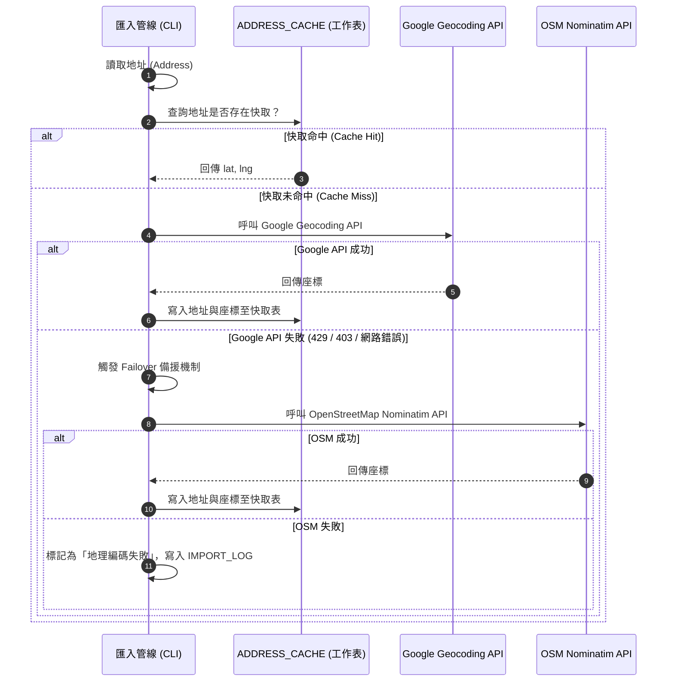
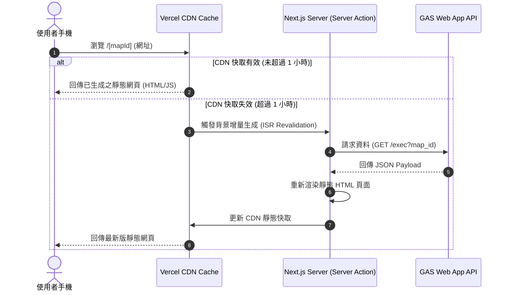

# Sheet2Map 技術設計文件 (TDD v1.0)

最後更新時間：2026-06-30
文件狀態：技術設計文件 (TDD) - 草稿 (Draft)
對照規格書：[UIMP_RPD_v1.6.md](file:///c:/Users/etrny/.gemini/antigravity/scratch/sheet2map/UIMP_RPD_v1.6.md)
對照字典檔：[GLOSSARY.md](file:///c:/Users/etrny/.gemini/antigravity/scratch/sheet2map/GLOSSARY.md)

---

## 1. 系統架構概述 (System Architecture Overview)

`Sheet2Map` 採用極簡的無資料庫伺服器架構，以 Google Spreadsheet 作為主要資料儲存與維護介面，並以 Google Apps Script (GAS) Web App 作為 API 閘道，提供資料給 Next.js 前端地圖渲染引擎。

```
[ 資料來源 (CSV/OpenData) ] 
      │
      ▼ (匯入管線 & Geocoding)
[ Google Spreadsheet (儲存空間) ] ◄──► [ GAS Web App API (HTTPS GET JSON) ]
                                                   │
                                                   ▼
                                       [ Next.js Frontend (ISR / Leaflet) ]
                                                   │
                                                   ▼
                                            [ Vercel CDN ]
```

---

## 2. API 介面設計 (Google Apps Script Web App)

GAS 腳本將部署為 Web 應用程式（權限設定為：Anyone, even anonymous），接收 HTTP GET 請求並返回通用 JSON 格式。

### 2.1 請求介面
*   **網址格式**：`https://script.google.com/macros/s/{SCRIPT_ID}/exec?map_id={map_id}`
*   **參數**：
    *   `map_id` (string): 對應 `Map Catalog` 中註冊的地圖識別碼。
    *   `spreadsheet_id` (string, 選填): 直接指定試算表 ID，用以調試或獨立載入。

### 2.2 回應結構 (JSON Schema)
```json
{
  "success": true,
  "config": {
    "map_id": "quit-smoking",
    "site_mode": "public",
    "theme_color": "green",
    "icon": "🚭",
    "default_zoom": 13,
    "show_directory": false,
    "enable_gps": true,
    "enable_share": true,
    "enable_favorites": false,
    "enable_cross_search": false
  },
  "metadata": {
    "title": "臺南市戒菸門診地圖",
    "description": "提供臺南市民眾快速查詢合規戒菸門診與諮詢院所之定位服務。",
    "category": "Government",
    "source_name": "臺南市政府衛生局",
    "source_url": "https://health.tainan.gov.tw/...",
    "source_date": "2026-06",
    "imported_at": "2026-06-28"
  },
  "points": [
    {
      "id": "p001",
      "name": "國立成功大學醫學院附設醫院",
      "lat": 22.9975,
      "lng": 120.2197,
      "category": "醫院",
      "address": "臺南市東區大學路1號",
      "district": "東區",
      "phone": "06-2353535",
      "website": "https://www.hosp.ncku.edu.tw/",
      "description": "設有家庭醫學科戒菸門診，提供專業諮詢。",
      "image": "https://...",
      "opening_hours": "週一至週五 08:30-17:00",
      "tags": ["公立", "教學醫院"],
      "custom_fields": {
        "custom_hospital_level": "醫學中心"
      }
    }
  ]
}
```

---

## 3. 前端資料模型定義 (TypeScript Types)

於前端 `src/types/map.ts` 定義標準資料型態：

```typescript
export interface MapConfig {
  map_id: string;
  site_mode: 'public' | 'hub';
  theme_color: string;
  icon: string;
  default_zoom: number;
  show_directory: boolean;
  enable_gps: boolean;
  enable_share: boolean;
  enable_favorites: boolean;
  enable_cross_search: boolean;
}

export interface MapMetadata {
  title: string;
  description?: string;
  category: string;
  source_name: string;
  source_url: string;
  source_date: string;
  imported_at: string;
  maintainer?: string;
}

export interface MapPoint {
  id: string;
  name: string;
  lat: number;
  lng: number;
  category: string;
  address?: string;
  district?: string;
  phone?: string;
  website?: string;
  description?: string;
  image?: string;
  opening_hours?: string;
  tags?: string[];
  custom_fields?: Record<string, any>;
}

export interface MapDataPayload {
  success: boolean;
  config: MapConfig;
  metadata: MapMetadata;
  points: MapPoint[];
}
```

---

## 4. 關鍵技術流程設計 (Sequence Flows)

### 4.1 備援地理編碼與快取寫入流程 (Geocoding with OSM Fallback)
此流程運行於資料匯入 CLI 工具或 Apps Script 中。



### 4.2 前端 SSR/ISR 取得資料流程
為了因應 Google Quota 限制並確保極速載入，採用 Vercel CDN 快取。



---

## 5. 前端組件架構 (Component Architecture)

```
[page.tsx (動態路由容器)]
   └── [MapProvider (管理地圖 Config 與點位狀態)]
          ├── [MapCatalogHeader (僅 Hub 模式呈現：多圖切換與導覽)]
          ├── [SearchBar (關鍵字搜尋過濾)]
          ├── [CategoryFilter (次分類標籤過濾卡片)]
          ├── [LeafletMap (地圖渲染主體 - Client Component)]
          │      ├── [MarkerCluster (點位聚合組件)]
          │      └── [UserLocationMarker (個人 GPS 定位點)]
          ├── [DetailDrawer (地標詳情下抽屜/側面板)]
          └── [MapDataFooter (透明度聲明與資料來源資訊)]
```

---

## 6. MVP 核心代碼設計 (Core Implementation Draft)

### 6.1 Google Apps Script API 代理 (`doGet` 實作草稿)
部署於 Google Drive 作為統一入口 Web App 的核心邏輯：

```javascript
function doGet(e) {
  try {
    const mapId = e.parameter.map_id;
    if (!mapId) {
      return createJsonResponse({ success: false, error: "Missing map_id parameter" });
    }

    // 1. 開啟全域 Map Catalog 試算表
    const catalogSpreadsheetId = "YOUR_GLOBAL_CATALOG_SPREADSHEET_ID";
    const catalogSheet = SpreadsheetApp.openById(catalogSpreadsheetId).getSheetByName("MAP_LIST");
    const catalogData = getSheetRows(catalogSheet);
    
    // 2. 尋找對應的 spreadsheet_id 與 Config
    const mapConfig = catalogData.find(row => row.map_id === mapId && row.status === "active");
    if (!mapConfig) {
      return createJsonResponse({ success: false, error: "Map not found or inactive" });
    }

    // 3. 讀取目標地圖試算表
    const targetSpreadsheet = SpreadsheetApp.openById(mapConfig.spreadsheet_id);
    
    // 4. 讀取 MAP_METADATA 與 POINTS
    const metadataSheet = targetSpreadsheet.getSheetByName("MAP_METADATA");
    const pointsSheet = targetSpreadsheet.getSheetByName("POINTS");
    
    const metadata = getSheetRows(metadataSheet)[0] || {};
    const pointsRaw = getSheetRows(pointsSheet);

    // 5. 格式化輸出點位與 Custom Fields
    const points = pointsRaw.map(p => {
      const standardKeys = ["id", "name", "lat", "lng", "category", "address", "district", "phone", "website", "description", "image", "opening_hours", "tags"];
      const custom_fields = {};
      
      // 自動歸納 custom_xxx
      Object.keys(p).forEach(key => {
        if (!standardKeys.includes(key) && key.startsWith("custom_")) {
          custom_fields[key] = p[key];
        }
      });

      return {
        id: String(p.id),
        name: String(p.name),
        lat: parseFloat(p.lat),
        lng: parseFloat(p.lng),
        category: String(p.category),
        address: p.address || "",
        district: p.district || "",
        phone: p.phone || "",
        website: p.website || "",
        description: p.description || "",
        image: p.image || "",
        opening_hours: p.opening_hours || "",
        tags: p.tags ? String(p.tags).split(",").map(t => t.strip()) : [],
        custom_fields: custom_fields
      };
    });

    const payload = {
      success: true,
      config: {
        map_id: mapConfig.map_id,
        site_mode: mapConfig.visibility === "public" ? "public" : "hub",
        theme_color: mapConfig.theme_color || "blue",
        icon: mapConfig.icon || "📍",
        default_zoom: parseInt(mapConfig.default_zoom) || 13,
        show_directory: mapConfig.visibility !== "public",
        enable_gps: mapConfig.enable_gps !== "FALSE",
        enable_share: mapConfig.enable_share !== "FALSE",
        enable_favorites: mapConfig.enable_favorites === "TRUE",
        enable_cross_search: mapConfig.enable_cross_search === "TRUE"
      },
      metadata: metadata,
      points: points
    };

    return createJsonResponse(payload);
  } catch (err) {
    return createJsonResponse({ success: false, error: err.message });
  }
}

function getSheetRows(sheet) {
  const range = sheet.getDataRange();
  const values = range.getValues();
  if (values.length <= 1) return [];
  
  const headers = values[0];
  const rows = [];
  
  for (let i = 1; i < values.length; i++) {
    const row = {};
    for (let j = 0; j < headers.length; j++) {
      row[headers[j]] = values[i][j];
    }
    rows.push(row);
  }
  return rows;
}

function createJsonResponse(data) {
  const JSONString = JSON.stringify(data);
  return ContentService.createTextOutput(JSONString).setMimeType(ContentService.MimeType.JSON);
}
```
